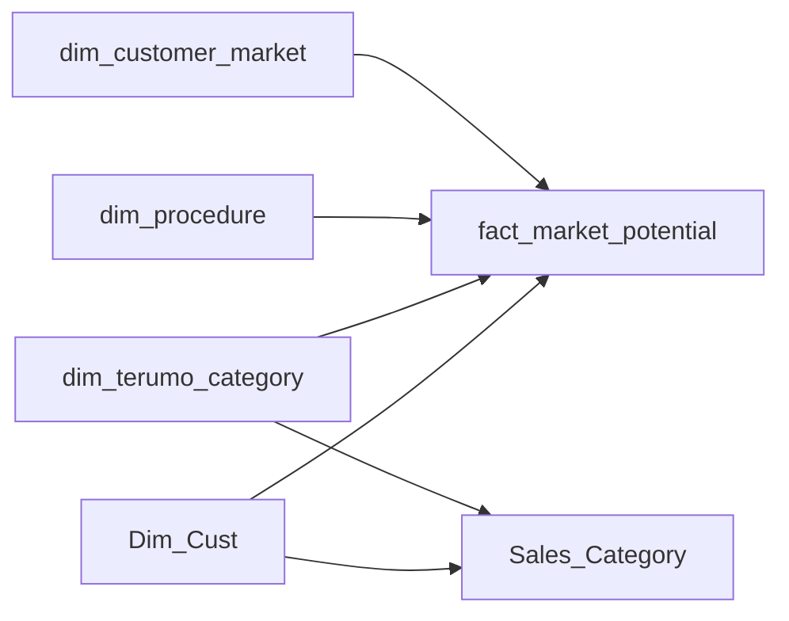

# Model Hardening Spec

## Goal

Raise the market potential dashboard from pilot-grade to production-safer by:

1. aligning benchmark logic to one segmentation basis
2. reducing relationship ambiguity
3. reweighting priority measures toward monetizable opportunity
4. making validation repeatable before live deployment

This spec is written against:

- [PotentialMarket.SemanticModel/model.bim](/C:/Users/adebo/reports/potential%20db/PotentialMarket.SemanticModel/model.bim)
- [BUILD_CLARIFICATIONS.md](/C:/Users/adebo/reports/potential%20db/BUILD_CLARIFICATIONS.md)
- [DASHBOARD_SPEC.md](/C:/Users/adebo/reports/potential%20db/specs/DASHBOARD_SPEC.md)

## Executive Call

The current model is good enough for a controlled internal pilot, but not yet strong enough to be called decision-safe for live commercial steering.

The two biggest issues are:

1. Benchmarking currently keys off `Dim_Cust[TIS Final Segmenation]` while the dashboard experience is built around `fact_market_potential[customer_segment]`.
2. The wider semantic model still contains several bidirectional relationships unrelated to the potential logic, which increases ambiguity and maintenance risk.

## Recommended Relationship Shape

For the market potential pages, the effective model should behave like this:



Target principles:

- single-direction filters only on the market-potential star
- dimensions filter facts
- no bidirectional filtering needed for the potential pages
- no dependency on legacy security/assignment paths for benchmark calculations

## Relationship Changes

### Keep

Keep these active and single-direction:

1. `Dim_Cust[Customer] -> fact_market_potential[customer_id]`
2. `Dim_Cust[Customer] -> Sales_Category[Customer Id]`
3. `dim_terumo_category[terumo_category] -> fact_market_potential[terumo_category]`
4. `dim_terumo_category[terumo_category] -> Sales_Category[Terumo Category]`
5. `dim_procedure[procedure_group] -> fact_market_potential[procedure_group]`
6. `dim_customer_market[customer_market_key] -> fact_market_potential[customer_market_key]`

### Disable for this dashboard model if possible

These are not inherently wrong in the broader enterprise model, but they should not influence the potential pages:

1. `DATA <-> Dim_Cust`
2. `Segmentation Cardio <-> Dim_Cust`
3. `Segmentation IO <-> Dim_Cust`
4. `Segmentation PI <-> Dim_Cust`
5. `Period <-> Dim_Cal`
6. `Data_SA <-> Bridge_SA`

If you cannot remove them from the shared model, the safer option is:

1. create a report-specific semantic model for the potential dashboard
2. keep only the tables needed for the potential use case
3. move RLS into that slimmer model later in v1.1

## Canonical Benchmark Segment

## Decision

Use one segment basis for benchmarking and slicing. The recommended canonical field is:

- `fact_market_potential[customer_segment]`

Reason:

- it belongs to the actual market potential grain
- it matches the page-level filter design in the build clarifications
- it avoids silently mixing legacy T360 segmentation logic into peer benchmarking

## Implementation Option A: Preferred

Add a small benchmark dimension:

- `dim_benchmark_customer`

Columns:

1. `customer_id`
2. `country_text`
3. `benchmark_segment`

One row per customer.

Relationships:

1. `dim_benchmark_customer[customer_id] -> Dim_Cust[Customer]`
2. keep it single-direction from `dim_benchmark_customer` to `Dim_Cust` only if needed for explicit measure logic

Populate `benchmark_segment` from the potential pipeline, not from the legacy segmentation tables.

## Implementation Option B: Acceptable Short-Term

If you do not want a new dimension yet, add a calculated column on `Dim_Cust` sourced from the potential data during ETL or Power Query:

- `Dim_Cust[Benchmark Segment]`

Do not build this as a fragile DAX workaround if the live source can provide it directly.

## DAX Replacements

All replacement measures below assume you create:

- `Dim_Cust[Benchmark Segment]`

If you instead create `dim_benchmark_customer`, swap references accordingly.

### 1. MS Benchmark Share %

Current issue:

- benchmark is based on `Dim_Cust[TIS Final Segmenation]`
- that can diverge from the segment users believe they are filtering

Replace with:

```DAX
MS Benchmark Share % =
VAR CountrySegmentRate =
    CALCULATE (
        [MS Estimated Share %],
        ALLEXCEPT (
            Dim_Cust,
            Dim_Cust[Country Text],
            Dim_Cust[Benchmark Segment]
        )
    )
VAR CountryRate =
    CALCULATE (
        [MS Estimated Share %],
        ALLEXCEPT (
            Dim_Cust,
            Dim_Cust[Country Text]
        )
    )
VAR SegmentRate =
    CALCULATE (
        [MS Estimated Share %],
        ALLEXCEPT (
            Dim_Cust,
            Dim_Cust[Benchmark Segment]
        )
    )
VAR NationalRate =
    CALCULATE (
        [MS Estimated Share %],
        REMOVEFILTERS ( Dim_Cust )
    )
VAR ChosenRate =
    COALESCE ( CountrySegmentRate, CountryRate, SegmentRate, NationalRate )
RETURN
    MIN ( 1, ChosenRate )
```

### 2. MS Benchmark Level

Replace with:

```DAX
MS Benchmark Level =
VAR CountrySegmentRate =
    CALCULATE (
        [MS Estimated Share %],
        ALLEXCEPT (
            Dim_Cust,
            Dim_Cust[Country Text],
            Dim_Cust[Benchmark Segment]
        )
    )
VAR CountryRate =
    CALCULATE (
        [MS Estimated Share %],
        ALLEXCEPT (
            Dim_Cust,
            Dim_Cust[Country Text]
        )
    )
VAR SegmentRate =
    CALCULATE (
        [MS Estimated Share %],
        ALLEXCEPT (
            Dim_Cust,
            Dim_Cust[Benchmark Segment]
        )
    )
RETURN
    SWITCH (
        TRUE (),
        NOT ISBLANK ( CountrySegmentRate ), "Country + Segment",
        NOT ISBLANK ( CountryRate ), "Country",
        NOT ISBLANK ( SegmentRate ), "Segment",
        "National"
    )
```

### 3. MS Customer Revenue Share

Current issue:

- denominator is all visible customer revenue after `REMOVEFILTERS ( Dim_Cust )`
- that may be acceptable, but it is ambiguous to end users

If you want share within the visible portfolio, rename it:

- `MS Customer Revenue Share of Visible Portfolio`

If you want a stable national/category denominator, use:

```DAX
MS Customer Revenue Share =
DIVIDE (
    [Pot Realized Sales EUR],
    CALCULATE (
        [Pot Realized Sales EUR],
        REMOVEFILTERS ( Dim_Cust[Customer] ),
        VALUES ( Dim_Cust[Country Text] ),
        VALUES ( dim_terumo_category[terumo_category] )
    )
)
```

This keeps the current country/category slice while removing only the individual customer.

### 4. MS Account Priority Score

Current issue:

- large accounts with many whitespace categories can outrank smaller accounts with larger monetizable gaps

Replace with:

```DAX
MS Account Priority Score =
VAR GapEUR = [Pot Gap EUR]
VAR RI = [MS Realization Index]
VAR RIShortfallFactor =
    DIVIDE ( MAX ( 0, 120 - COALESCE ( RI, 0 ) ), 100, 0 )
VAR BenchmarkWeight =
    SWITCH (
        [MS Benchmark Level],
        "Country + Segment", 1.00,
        "Country", 0.90,
        "Segment", 0.80,
        0.65
    )
VAR RealizedRevenueFloor =
    IF ( [Pot Realized Sales EUR] >= 10000, 1, 0.85 )
RETURN
    IF (
        ISBLANK ( GapEUR ) || GapEUR <= 0,
        0,
        ROUND ( GapEUR * MAX ( 0.25, RIShortfallFactor ) * BenchmarkWeight * RealizedRevenueFloor, 0 )
    )
```

This keeps the score commercial:

- bigger revenue gap scores higher
- underperforming accounts score higher
- weaker benchmark confidence is slightly discounted

### 5. MS Customer Priority in Category

Current issue:

- heavily dependent on gap units and revenue share
- less directly tied to revenue value than it could be

Replace with:

```DAX
MS Customer Priority in Category =
VAR GapEUR = [Pot Gap EUR]
VAR RI = [MS Realization Index]
VAR RIShortfallFactor =
    DIVIDE ( MAX ( 0, 130 - COALESCE ( RI, 0 ) ), 100, 0 )
VAR RevenueImportance =
    MAX ( 0.05, COALESCE ( [MS Customer Revenue Share], 0 ) )
RETURN
    IF (
        ISBLANK ( GapEUR ) || GapEUR <= 0,
        0,
        ROUND ( GapEUR * MAX ( 0.25, RIShortfallFactor ) * RevenueImportance, 0 )
    )
```

### 6. MS Total Addressable Market EUR

Current issue:

- `CROSSJOIN` can overstate combinations and scale poorly

Replace with a fact-anchored approach:

```DAX
MS Total Addressable Market EUR =
SUMX (
    SUMMARIZE (
        fact_market_potential,
        fact_market_potential[customer_id],
        fact_market_potential[terumo_category]
    ),
    [MS Targetable Units] * [Pot Avg Price EUR]
)
```

This keeps the metric grounded in existing potential rows only.

### 7. Optional: Benchmark Quality Weight

Add:

```DAX
MS Benchmark Quality Weight =
SWITCH (
    [MS Benchmark Level],
    "Country + Segment", 1.00,
    "Country", 0.90,
    "Segment", 0.80,
    0.65
)
```

Use this in tooltips and priority measures.

## Optional ETL Improvements

Before live deployment, strongly type these in the source/model:

1. `fact_market_potential[year]`
2. `fact_market_potential[procedures]`
3. `fact_market_potential[qty_units_per_procedure]`
4. `fact_market_potential[usage_rate_final]`
5. `fact_market_potential[allocation_weight]`

Recommended target types:

- `year`: whole number
- all others: decimal number except where whole number is guaranteed

## Build Order

1. Create `Dim_Cust[Benchmark Segment]` or `dim_benchmark_customer`
2. Rewrite `MS Benchmark Share %`
3. Rewrite `MS Benchmark Level`
4. Rewrite the two priority measures
5. Rewrite `MS Customer Revenue Share`
6. Rewrite `MS Total Addressable Market EUR`
7. Validate against known customer examples
8. Only then tune report visuals/sorts/colors

## Validation Script

Run these checks before accepting the live model.

### 1. Segment Parity

For at least 20 live customers across multiple countries:

- compare old segmentation source
- compare potential benchmark segment
- document mismatches

Pass condition:

- either exact parity
- or a signed decision that the new benchmark segment is the source of truth

### 2. Join Uniqueness

Confirm uniqueness on:

1. `Dim_Cust[Customer]`
2. `dim_terumo_category[terumo_category]`
3. `dim_procedure[procedure_group]`
4. `dim_customer_market[customer_market_key]`

Pass condition:

- no duplicate keys on lookup tables

### 3. Benchmark Reconciliation

For 5 accounts:

1. calculate realized qty manually
2. calculate potential units manually
3. calculate estimated share manually
4. identify expected benchmark cohort
5. verify benchmark share and RI in Power BI

Pass condition:

- RI variance within rounding tolerance only

### 4. Priority Sanity Check

Review the top 20 accounts and top 20 customer-category combinations with sales leadership.

Pass condition:

- rankings are commercially sensible
- no obvious high-gap accounts are missing

### 5. Filter Propagation

Test:

1. country
2. segment
3. category
4. customer
5. target RI slider

Pass condition:

- sales and potential measures move consistently together

### 6. Sparse Cohort Check

Test small countries or thin segments.

Pass condition:

- benchmark level falls back predictably
- no extreme RI inflation caused by tiny denominators

### 7. Performance Check

Test page load and common slicer interactions on live volume.

Pass condition:

- page transitions and slicer updates remain acceptable for commercial users

## Definition of Done

This dashboard becomes production-safer when all of the following are true:

1. benchmark logic uses one canonical segment definition
2. no unnecessary bidirectional relationship affects the potential star
3. priority scores are revenue-opportunity-led
4. benchmark level is visible to users
5. core measures reconcile on sample accounts
6. live filter propagation works cleanly
7. performance is acceptable on live data

## Suggested Next Build Step

Use Tabular Editor to implement the DAX replacements first. Do not adjust visual logic until the measure layer is stable, because the page rankings and action badges depend on these measures being trustworthy.
